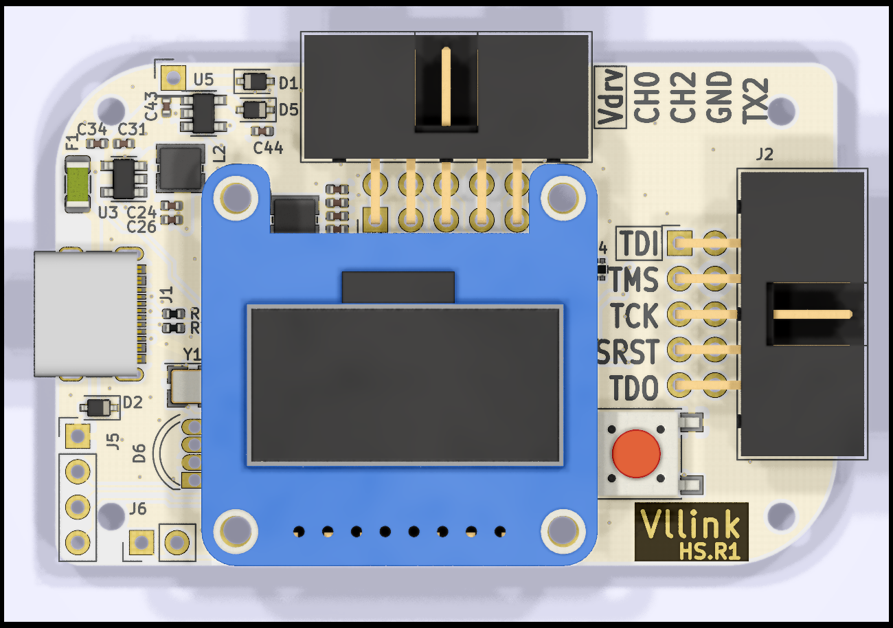
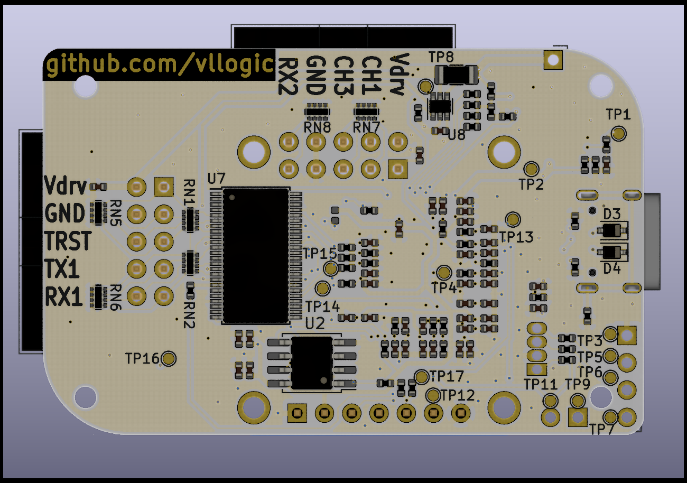
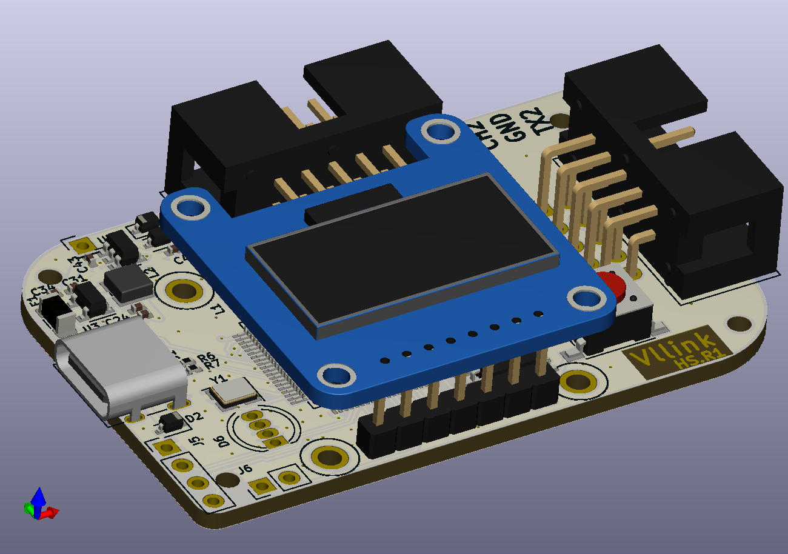

# Vllink HighSpeed

## 简介

Vllink Highspeed是一款中低成本高性能调试器。相比Lite版，支持USB2.0高速、更好的IO时序优化、更好的CPU速度，预计JTAG/SWD接口对目标芯片SRAM速度可以达到MB/S的级别，媲美当前千元级别调试器。

## 硬件

## 功能
* JTAG/SWD接口(TDI,TMS,TCK,SRST,TDO,TRST)
* 2路独立串口(TX1,RX1,TX2,RX2)，1路共用串口(TDO,SRST)
* 4通道逻辑分析输入口(CH0,CH1,CH2,CH3)
* 具有电平转换电路，同时支持外部参考电源与内部数字可调电源1.5V至4.75V(Vdrv)
* 使用内部电源对外供电时，支持电流测量(Vdrv)
* OLED_12864(全彩LED可选)
* 远超同等价格级别硬件的Code/Data空间
